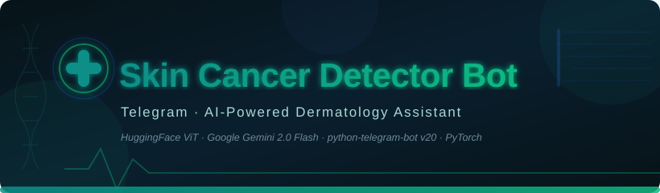
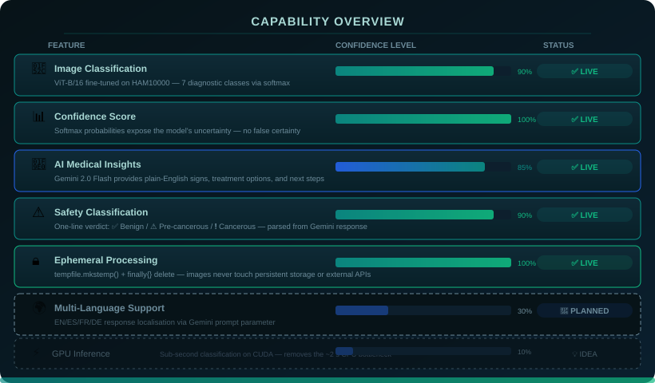
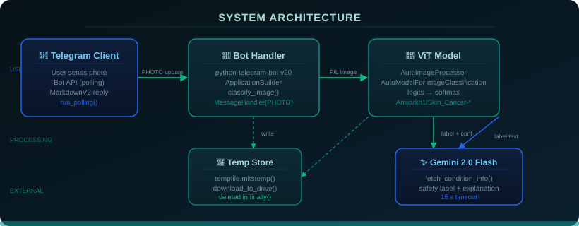
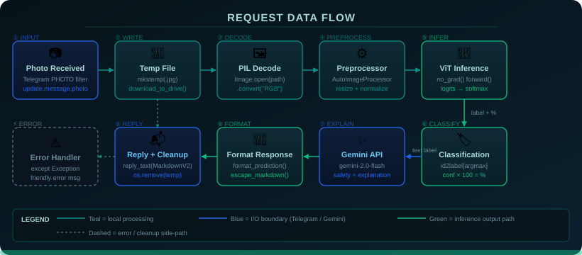
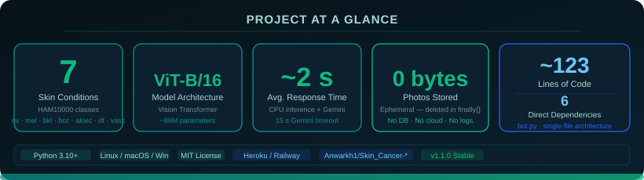

<!-- README: Telegram Skin Cancer Detector Bot -->

<div align="center">



**Send a photo. Get a diagnosis. Go see a real doctor.**

[Features](#-features) • [Installation](#%EF%B8%8F-installation) • [Usage](#-usage) • [Architecture](#%EF%B8%8F-architecture) • [Roadmap](#%EF%B8%8F-roadmap) • [License](#-license)

</div>

---

*I built this because dermatology appointments take six weeks to schedule and skin cancer is one of the most visually detectable cancers on the planet. A ViT model and a Gemini API call won't replace your dermatologist — but they might tell you whether it's worth fighting for that appointment.*

A Telegram bot that classifies photos of skin lesions using a fine-tuned Vision Transformer (ViT-B/16) from HuggingFace, then fires a text-only label to Google Gemini 2.0 Flash for a plain-English breakdown: what the condition is, what signs to watch for, treatment options, and a one-line severity verdict. Seven HAM10000 diagnostic classes. No images ever leave your server. No database. One Python file.

---

[](https://www.python.org/)
[](https://python-telegram-bot.org/)
[](https://huggingface.co/)
[](https://aistudio.google.com/)
[](LICENSE)
[](CHANGELOG.md)

> **⚕️ Medical Disclaimer:** This is a research and educational tool. It is **not** a substitute for professional medical advice, diagnosis, or treatment. Always consult a qualified dermatologist. No, really — go see a human.

---

## 🗂️ System Overview

The entire service is a single Python file (`bot.py`) that boots a `python-telegram-bot` v20 polling loop, handles incoming `PHOTO` messages, runs local ViT inference via HuggingFace Transformers, and calls the Gemini REST API for a human-readable explanation. No web server. No persistent storage. No async event loop wrestling — PTB v20 handles that internally.

```
Telegram_skin_cancer_detector/
├── bot.py              # Single-file service: Telegram handler + ViT inference + Gemini client
├── requirements.txt    # Six direct dependencies
├── Procfile            # Heroku/Railway worker process declaration
├── .env.example        # Required environment variable template
├── .gitignore          # Excludes .env, __pycache__, .venv, model cache
├── CONTRIBUTING.md     # Contribution guidelines
├── CHANGELOG.md        # Version history
├── SECURITY.md         # Vulnerability disclosure policy
├── LICENSE             # MIT
├── assets/             # README visual assets (SVGs)
│   ├── hero-banner.svg
│   ├── architecture.svg
│   ├── data-flow.svg
│   ├── capabilities.svg
│   └── stats.svg
└── wiki/               # Extended documentation
    ├── Home.md
    ├── Architecture.md
    ├── Installation.md
    ├── Usage.md
    ├── Privacy.md
    ├── Troubleshooting.md
    └── Roadmap.md
```

See the architecture diagram below for the full component layout.

---

## ✨ Features

| Feature | What It Actually Does |
|---|---|
| 🔬 **Image Classification** | Runs a ViT-B/16 fine-tuned on the HAM10000 dataset; classifies a lesion photo into one of 7 diagnostic categories using softmax over logits |
| 📊 **Confidence Score** | Exposes the raw softmax probability as a percentage so you know if the model is "94% sure" vs "barely better than a coin toss" |
| 🧠 **AI Medical Insights** | Sends only the text label to Gemini 2.0 Flash; gets back signs, treatment options, and next-step advice in plain English |
| ⚠️ **Safety Label** | Parses the first line of the Gemini response into a one-line verdict: ✅ Harmless / ⚠️ Pre-cancerous / ❗ Cancerous |
| 🔒 **Ephemeral Processing** | Image written to `tempfile.mkstemp()`, processed locally, then deleted unconditionally in a `finally` block — even if the model throws an exception |
| 🛡️ **Graceful Error Handling** | API timeouts (15 s hard cutoff), model errors, and malformed images are all caught and converted to user-friendly Telegram messages |
| 🚀 **Zero Persistence** | No database, no photo logs, no user tracking, no subscription screen. Just Python and inference. |
| ⚡ **Startup Validation** | Both `BOT_TOKEN` and `GEMINI_API_KEY` are validated at process start — misconfigured deployments crash loudly before they can fail silently |

---

## 🔬 Capability Visualization

<div align="center">



</div>

---

## 🏗️ Architecture

<div align="center">



</div>

The bot runs as a single OS process with PTB v20's internal asyncio event loop. Incoming Telegram updates arrive via long-polling (`run_polling()`), so there is no inbound network port — the bot always initiates the connection to Telegram's servers. Each photo message is handled by `classify_image()`, which runs the ViT model synchronously inside the async handler (acceptable for a single-user or low-traffic bot; GPU inference or a worker queue would be needed for high concurrency).

The two external calls — HuggingFace model weights (downloaded once on first start, then cached) and Gemini REST API (every request) — are kept strictly separated. The image never leaves the host machine; only the text classification label crosses the network boundary to Gemini. `BOT_TOKEN` and `GEMINI_API_KEY` are loaded from environment variables at startup and are never printed, logged, or included in any outbound request payload.

---

## 🌊 Data Flow

<div align="center">



</div>

Primary data path — from photo to reply:

```
Telegram photo upload
  → bot.py: photo[-1].get_file()          # highest-res variant
  → tempfile.mkstemp(".jpg")              # OS temp dir, collision-safe
  → PIL.Image.open().convert("RGB")       # decode + normalise channels
  → AutoImageProcessor(images=img)        # resize + pixel normalisation
  → model(**inputs) [torch.no_grad()]     # ViT forward pass, CPU
  → softmax(logits) → argmax → label      # id2label lookup + %
  → Gemini REST API (label text only)     # 15 s timeout
  → format_prediction() + escape_markdown()
  → update.message.reply_text(MarkdownV2)
  → os.remove(temp_path)                  # always, in finally{}
```

---

## ⚙️ Installation

### Prerequisites

- **Python 3.10+** — `match` statements and `tuple[str, str]` type hints are used; 3.9 and below will not work.
- A **Telegram Bot Token** from [BotFather](https://t.me/BotFather) — takes about 2 minutes.
- A **Google Gemini API Key** from [AI Studio](https://aistudio.google.com/app/apikey) — free tier is sufficient.

### 1. Clone the repository

```bash
git clone https://github.com/Kaelith69/Telegram_skin_cancer_detector.git
cd Telegram_skin_cancer_detector
```

### 2. Create a virtual environment *(strongly recommended)*

```bash
python -m venv .venv
source .venv/bin/activate        # macOS / Linux
# .venv\Scripts\activate         # Windows PowerShell
```

### 3. Install dependencies

```bash
pip install -r requirements.txt
```

| Package | Why it's here |
|---------|---------------|
| `python-telegram-bot==20.7` | Telegram Bot API wrapper — provides the polling loop, update parsing, and `reply_text` |
| `transformers` | HuggingFace library that loads the ViT model weights and image processor |
| `torch` | PyTorch inference backend — runs the ViT forward pass locally |
| `Pillow` | Decodes the downloaded JPEG and converts colour spaces before preprocessing |
| `requests` | Makes the HTTP POST to the Gemini REST API |
| `python-dotenv` | Loads `BOT_TOKEN` and `GEMINI_API_KEY` from the `.env` file at startup |

> ⚠️ The ViT model weights (~300 MB) are downloaded from HuggingFace Hub on **first run** and cached locally (usually `~/.cache/huggingface/`). Subsequent starts are fast.

### 4. Configure environment variables

```bash
cp .env.example .env
```

Edit `.env`:

```dotenv
BOT_TOKEN=123456789:ABCdefGHIjklMNOpqrSTUvwxYZ
GEMINI_API_KEY=AIzaSy...
```

> **Never commit `.env`.** It is already in `.gitignore`. But you knew that.

### 5. Run the bot

```bash
python bot.py
```

Expected output on successful start:

```
🤖 Skin Diagnosis Bot is live.
```

If you see `RuntimeError: BOT_TOKEN environment variable is not set` — you skipped Step 4.

---

## 🚀 Usage

1. Open Telegram and search for the bot by the username you gave it in BotFather.
2. Send a **clear, well-lit photo** of a skin lesion directly in the chat. Blurry photos will still get classified — just with lower confidence.
3. Wait approximately 2 seconds (CPU inference + Gemini round-trip).
4. The bot replies with a structured result:

```
🧾 Diagnosis Result
• Condition:   Melanocytic nevi
• Confidence:  94.73%
• Type:        ✅ Harmless - Non-Cancerous

Medical Insight:
Melanocytic nevi (moles) are benign clusters of pigmented cells...
Signs: Small, round, evenly pigmented spots...
Treatment: Usually no treatment needed unless they change in size, shape, or colour...
What to do: Monitor using the ABCDE criteria. Annual dermatologist check recommended.
```

5. Send anything other than a photo and the bot asks you politely to send one.

> **Pro tip:** The model was trained on dermatoscopic images (close-up, uniform lighting, no reflections). Macro photos taken with a phone camera will work, but dermatoscopic images will give more accurate results. If you have access to a dermatoscope adapter for your phone, use it.

### Classifiable conditions (HAM10000)

| Code | Full Name | Severity |
|------|-----------|----------|
| `nv`    | Melanocytic Nevi                          | ✅ Benign |
| `bkl`   | Benign Keratosis-like Lesions             | ✅ Benign |
| `df`    | Dermatofibroma                            | ✅ Benign |
| `vasc`  | Vascular Lesions                          | ✅ Benign |
| `akiec` | Actinic Keratoses / Intraepithelial Carcinoma | ⚠️ Pre-cancerous |
| `bcc`   | Basal Cell Carcinoma                      | ❗ Cancerous |
| `mel`   | Melanoma                                  | ❗ Cancerous |

---

## 📁 Project Structure

```
Telegram_skin_cancer_detector/
│
├── 🐍 bot.py               # Everything: Telegram handler, ViT inference, Gemini client, response formatter
├── 📋 requirements.txt     # 6 direct dependencies — keep it lean
├── ⚙️  Procfile             # Heroku/Railway: "worker: python bot.py"
├── 🔑 .env.example         # BOT_TOKEN and GEMINI_API_KEY template
├── 🚫 .gitignore           # .env, __pycache__, .venv, HuggingFace model cache
│
├── 📖 README.md            # This document
├── 📝 CONTRIBUTING.md      # How to contribute without breaking things
├── 📜 CHANGELOG.md         # What changed in each version
├── 🔐 SECURITY.md          # Vulnerability disclosure and security design notes
├── ⚖️  LICENSE              # MIT
│
├── 🖼️  assets/              # SVG assets for the README
│   ├── hero-banner.svg
│   ├── architecture.svg
│   ├── data-flow.svg
│   ├── capabilities.svg
│   └── stats.svg
│
└── 📚 wiki/                # Extended documentation
    ├── Home.md
    ├── Architecture.md
    ├── Installation.md
    ├── Usage.md
    ├── Privacy.md
    ├── Troubleshooting.md
    └── Roadmap.md
```

---

## 📊 Performance Stats

<div align="center">



</div>

---

## 🔒 Privacy

Your images are **never stored, logged, or transmitted** beyond what's required for local inference.

Chain of custody for every photo:

1. Telegram delivers the file to the bot process.
2. `tempfile.mkstemp()` writes it to the OS temp directory (typically `/tmp/`).
3. The ViT model reads it **locally** — no image data leaves your server.
4. The `finally` block deletes the temp file **unconditionally**, including on model error.
5. Only the **text label** (e.g., `"Melanocytic nevi"`) is sent to the Gemini API — not the image, not your Telegram user ID, not any metadata.

No analytics. No telemetry. No "we'll use your lesions to train our next model." Full details in [wiki/Privacy.md](wiki/Privacy.md).

---

## 🗺️ Roadmap

### Core improvements
- [x] Image classification with ViT-B/16
- [x] Gemini-powered plain-English insights
- [x] Ephemeral image handling
- [x] Graceful error handling and fail-fast config validation
- [ ] `/start` command with onboarding instructions and disclaimer
- [ ] Top-3 predictions instead of top-1 (second-opinion mode)

### User experience
- [ ] Multi-language support (EN/ES/FR/DE) via Gemini prompt parameter
- [ ] Inline keyboard with "Book a dermatologist" links (configurable per region)
- [ ] ABCDE mole analysis overlay (asymmetry, border, colour, diameter, evolution)

### Performance
- [ ] GPU inference support for sub-second classification
- [ ] Async Gemini call to avoid blocking the event loop under load
- [ ] Webhook mode (replaces polling) for production deployments

Full details in [wiki/Roadmap.md](wiki/Roadmap.md).

---

## 📦 Deployment

The bot runs as a long-polling worker — no inbound port required.

### Heroku / Railway

The `Procfile` already declares the worker process:

```
worker: python bot.py
```

Set `BOT_TOKEN` and `GEMINI_API_KEY` as environment variables in your platform dashboard, then deploy. The HuggingFace model weights will be downloaded on first start (~300 MB), so allow 2–3 minutes for cold boot.

### Self-hosted (systemd)

```ini
[Unit]
Description=Skin Cancer Detector Telegram Bot
After=network.target

[Service]
WorkingDirectory=/opt/skin-bot
EnvironmentFile=/opt/skin-bot/.env
ExecStart=/opt/skin-bot/.venv/bin/python bot.py
Restart=on-failure

[Install]
WantedBy=multi-user.target
```

---

## 🤝 Contributing

Found a bug? You're now on the team. PRs welcome. See [CONTRIBUTING.md](CONTRIBUTING.md) for the full guide — branch naming, code style, what will and won't be merged.

---

## 🔐 Security

To report a vulnerability, please use [GitHub's private security advisory](https://github.com/Kaelith69/Telegram_skin_cancer_detector/security/advisories/new) rather than opening a public issue. See [SECURITY.md](SECURITY.md) for scope, response timelines, and the full security design rationale.

---

## 📄 License

Released under the [MIT License](LICENSE). Use it, fork it, build on it.

---

<div align="center">

*Built with 🤍, too much caffeine, and a genuine belief that early detection saves lives.*

</div>
